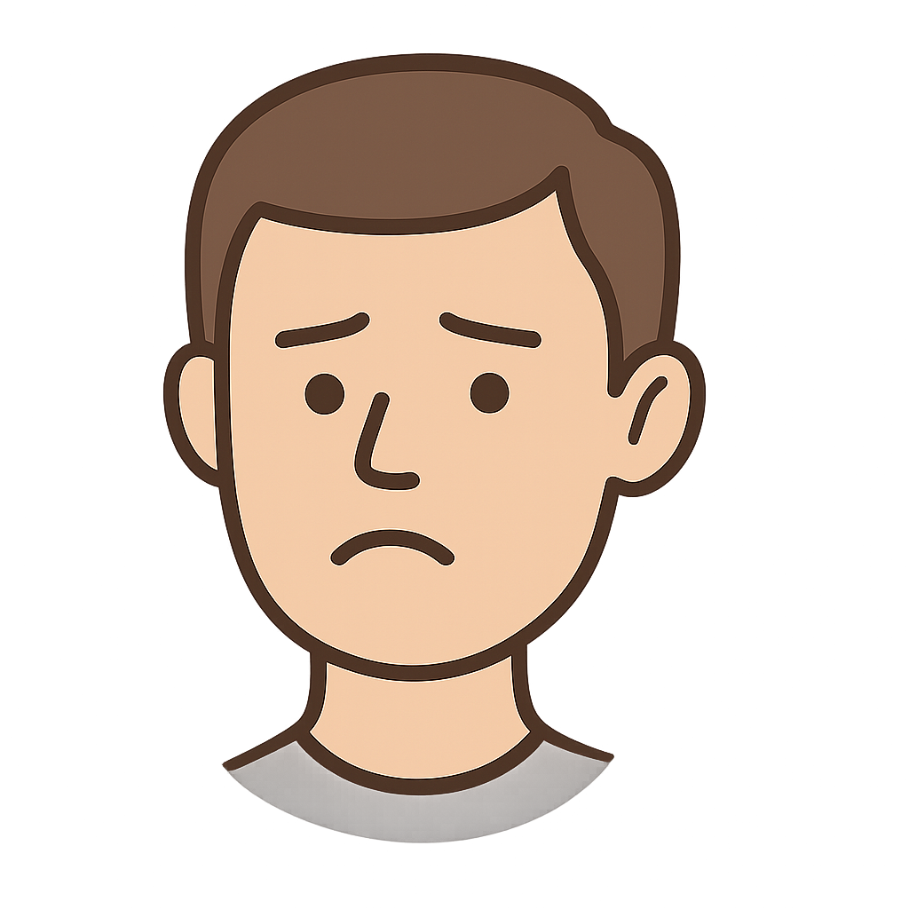

# VibeBoxing Web Edition

A simple webcam-based boxing target practice game built with JavaScript, Three.js, and MediaPipe, running entirely in your browser! Hit the targets with your fists!

 <!-- Replace with a screenshot/GIF later -->

## Features

*   Real-time hand tracking in the browser using MediaPipe JavaScript Solutions.
*   Boxing glove overlays on a live webcam feed background using Three.js.
*   Moving target with progressive visual "damage" based on hits.
*   Selectable timed rounds (30s / 60s).
*   Local high score leaderboard (stored in browser `localStorage`) for each time category.
*   Interactive UI built with HTML and CSS.

## Technologies Used

*   **HTML5**
*   **CSS3**
*   **JavaScript (ES Modules)**
*   **Three.js:** For 3D rendering (scene, camera, textures, geometry).
*   **MediaPipe Hands (JavaScript):** For webcam hand tracking via the browser.

## Running Locally

1.  **Clone the repository:**
    ```bash
    git clone https://github.com/CelebrityPunks/Vibeboxing.git
    cd Vibeboxing
    ```
2.  **Serve the files:** Since the game uses ES Modules, you need to serve the files using a simple local web server. The easiest way is using Python's built-in server:
    ```bash
    # Make sure you are in the Vibeboxing directory
    python3 -m http.server
    ```
    (If you don't have Python 3, you can use other tools like Node.js's `npx http-server` or the Live Server extension in VS Code).
3.  **Open in Browser:** Open your web browser and navigate to `http://localhost:8000` (or the address provided by your server).

Grant camera permissions when prompted by your browser.

## How to Play

1.  **Title Screen:** Allow webcam access. Choose a duration (30 or 60 seconds) by clicking the button.
2.  **Gameplay:**
    *   The game starts immediately. Your webcam feed shows in the background.
    *   Punch the target face that appears on screen with your fists (represented by glove images).
    *   The target moves after each hit and shows progressive damage.
    *   The timer counts down in the top-right corner.
    *   The score updates in the top-left corner.
3.  **Game Over:** When the timer reaches zero, the game ends.
    *   Your final score is displayed.
    *   If you achieved a high score (Top 5 for that duration), you'll be prompted to enter your name (max 10 chars). Click "Save Score" or press Enter.
    *   You can click "Back to Title" or "Play Again" (if available).
4.  **Leaderboard:** Click the "Leaderboard" button on the title screen to view the top 5 scores for each duration. Click "Back to Title" to return.

## Deployment

This project is a static web application and can be deployed to any static hosting service (like Netlify, Vercel, GitHub Pages, Cloudflare Pages, etc.). Ensure the host provides HTTPS, as webcam access requires a secure context.

*(Link to deployed version can be added here later)* 